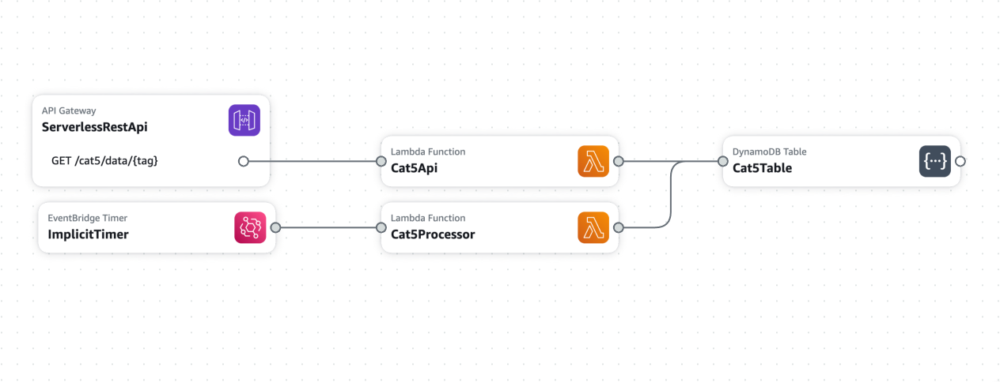

# CAT5
ESPN Fantasy Basketball H2H Categories Matchup Forecaster

Predict who will win each category

Predict who will win the matchup by winning Category Number 5!


## Service
Deployed to AWS using Lambda, DynamoDB, APIGateway, and EventBridge using SAM (Serverless Model).

Cloud Infra:



### Local Development
Created with python

#### Set up virtual environment:
```sh
python -m venv .venv
source .venv/bin/activate
pip install -r requirements.txt
```

See [Makefile](Makefile) for dev commands

#### Test:
```sh
make check
make test-unit
make test-integration
make test-cloud-integration
```

#### Build and Deploy:
Requires Docker, AWS CLI, SAM CLI
```sh
make sam
make invoke-processor
make invoke-api
make deploy
```


## UI
Created with React + Gatsby

See `package.json` for development commands
```sh
npm run start
npm run build
npm run serve
npm run deploy # to GitHub pages
```

Update [`gatsby-config.js`](/gatsby-config.js) for deployment configurations
